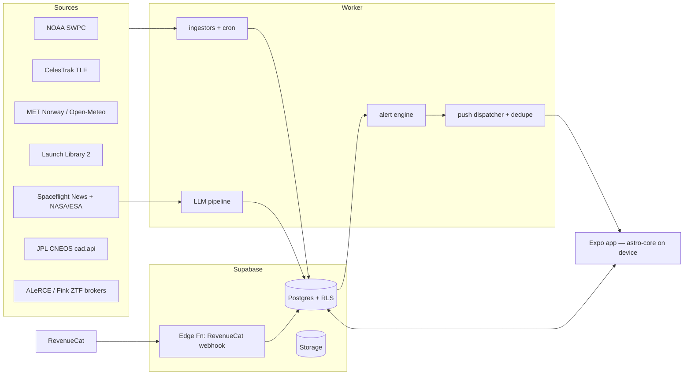

# PROJECT MASTER DOCUMENT — "VESPER" (working title)
**Version 1.1 · 11 Jul 2026 · Supersedes astro-app-spec.md v1**
Owner: Adrien · Status: Approved for build · Target: App Store + Play submission **3 Aug 2026**, eclipse day **12 Aug 2026**

---

## Table of contents

**PART A — PRODUCT**: 1. Vision · 2. Market & positioning · 3. Personas · 4. Requirements (FR/NFR) · 5. Feature catalog · 6. Monetization · 7. KPIs
**PART B — ENGINEERING**: 8. Stack · 9. Architecture · 10. Repo structure · 11. Data sources · 12. Algorithms · 13. Database · 14. Notifications · 15. News/LLM pipeline · 16. Security/Privacy/GDPR · 17. Testing · 18. Observability
**PART C — DELIVERY**: 19. Roadmap & milestones · 20. Launch checklist · 21. Marketing & distribution · 22. Budget · 23. Risk register · 24. Legal & IP · 25. Backlog

---

# PART A — PRODUCT

## 1. Vision & principles

**One-liner:** The one astronomy app to download — tonight's sky, real-time alerts, and space news, in your language, that never spams you.

**Product principles (tie-breakers for every decision):**
1. **Free is complete.** A casual stargazer lives a full life in the free tier. Pro = plan/shoot/chase, never basic access.
2. **Notifications earn trust.** Silence on a cloudy night is a feature. Every push answers "what do I do now?"
3. **Offline-first.** Dark-sky sites have no signal. Tonight view + tonight's passes always work offline.
4. **Honest data.** We name our sources (ZTF, NOAA, NASA). We never say "our telescopes."
5. **PT-first, international by design.** pt-PT, pt-BR, en, es at launch. French later — don't poke the incumbent's home market first.

**Explicit non-goals (v1–v2):** AR planetarium (Stellarium/Sky Guide own it) · encyclopedic object catalogs (SkySafari owns it) · community/UGC before traction (moderation burden) · web app.

## 2. Market & positioning

**Category proof:** Sirius Stars (FR) — launched Jan 2026 by YouTuber Zebroloss (~388K subs), 100k+ downloads, 4.9★ (201 ratings), free, no monetization, **French-only, iPhone-focused**. Validates the "astronomy media + alerts" category; leaves language, monetization, and notification quality on the table.

**International incumbents are per-feature, not all-in-one:** My Aurora Forecast (aurora), ISS Detector/Spot the Station (ISS), Sky Tonight/Star Walk (tonight view), NASA app (news), Next Spaceflight (launches). No dominant multilingual all-in-one media+alerts app.

**Our wedge:** (a) language markets Sirius can't serve (PT 260M+ speakers, ES 500M+); (b) the 12 Aug 2026 eclipse over Iberia as launch event; (c) notification quality as a visible differentiator; (d) freemium with fair pricing from day one.

**Positioning statement:** For sky-curious people in PT/ES/EN markets who miss every celestial event, VESPER is the astronomy companion that tells you what's visible from *your* spot *tonight* and alerts you only when it matters — unlike single-purpose tools or French-only Sirius.

## 3. Personas

| Persona | Profile | Jobs to be done | Tier |
|---|---|---|---|
| **Miguel, 24 — casual** | Saw aurora TikToks, owns no gear | "Tell me when something cool is visible, explain it simply" | Free |
| **Carla, 35 — aurora chaser** | Drives 1h to dark sites on Kp spikes | "Give me lead time and confidence before I burn fuel" | Pro (solar-wind early warning) |
| **Rui, 42 — astrophotographer** | €3k of gear, plans weekends | "Which nights are worth it; what fits my FOV" | Pro (astro-weather, shoot-tonight) |
| **Ana, 29 — Seestar owner** | Smart-telescope wave, low theory | "Just give me tonight's target list for my device" | Pro (target lists) |

## 4. Requirements

### 4.1 Functional requirements (MoSCoW, phased)

**Tonight (T)**
| ID | Requirement | Priority | Phase |
|---|---|---|---|
| FR-T01 | Show tonight's visible objects (Moon, planets) with rise/set, from device-local ephemeris | Must | 1 |
| FR-T02 | Sky-quality score 0–100 for user location (clouds + Moon + altitude + light pollution) | Must | 1 |
| FR-T03 | "Tonight's Top 3" ranked card | Must | 1 |
| FR-T04 | Equipment-tier filter: naked eye / binoculars / telescope (magnitude-gated) | Should | 1 |
| FR-T05 | Natural-language sky summary, localized, template-based (no LLM at runtime) | Should | 1 |
| FR-T06 | Darkness window (astronomical twilight) display | Should | 1 |

**Alerts (A)**
| ID | Requirement | Priority | Phase |
|---|---|---|---|
| FR-A01 | Aurora alert at geomagnetic-latitude-appropriate Kp threshold | Must | 1 |
| FR-A02 | ISS visible-pass alerts, default ≥40° max elevation, T−10 min | Must | 1 |
| FR-A03 | Per-topic notification preferences with sane defaults | Must | 1 |
| FR-A04 | Conjunction alerts (morning-of) | Should | 1 |
| FR-A05 | Moon-phase notifications (quarters/full/new), opt-in | Could | 1 |
| FR-A06 | Supernova/transient feed card (ZTF via broker); push only for exceptional events | Could | 2 |
| FR-A07 | Asteroid close-approach feed card (CNEOS); push only above taste thresholds (§14) | Could | 2 |
| FR-A08 | Aurora **early warning** from live solar wind (Bz/speed) — Pro | Should | 2 |
| FR-A09 | Rocket-launch alerts (opt-in) | Could | 2 |

**Eclipse (E) — v1 centerpiece**
| ID | Requirement | Priority | Phase |
|---|---|---|---|
| FR-E01 | Local circumstances for 12 Aug 2026: partial start/max/end, obscuration %, sun altitude | Must | 1 |
| FR-E02 | Countdown + D-7/D-1/T−1h/T−10min pushes | Must | 1 |
| FR-E03 | Cloud-cover outlook for eclipse hour (from ~Aug 5) | Must | 1 |
| FR-E04 | Eye-safety content, always free, prominent | Must | 1 |
| FR-E05 | Shareable eclipse card (image with local times) | Should | 1 |
| FR-E06 | Live Activity during eclipse | Stretch | 1 |

**Calendar (C)**
| ID | Requirement | Priority | Phase |
|---|---|---|---|
| FR-C01 | Scrollable day-by-day event calendar (planets, Moon, comets, showers) with equipment filter | Should | 1 (lite) |
| FR-C02 | DSO daily list (Messier: rise time, tier-gated) | Could | 2 |
| FR-C03 | Add event to device calendar | Could | 2 |

**News (N)**
| ID | Requirement | Priority | Phase |
|---|---|---|---|
| FR-N01 | Auto-generated space-news feed (LLM rewrite from primary sources), localized, Q&A article template, visible source line | Must | 1 |
| FR-N02 | Missions/launches page (Launch Library 2) | Should | 2 |
| FR-N03 | Like/share on articles | Could | 2 |
| FR-N04 | Comments | Won't (v1–2) | 3 |

**Platform (P)**
| ID | Requirement | Priority | Phase |
|---|---|---|---|
| FR-P01 | Location: GPS (approximate ok) + manual city picker; multiple saved locations = Pro | Must | 1 |
| FR-P02 | Anonymous-first: full app without account | Must | 1 |
| FR-P03 | Paywall + purchases via RevenueCat; restore purchases | Must | 1 |
| FR-P04 | Observation log (always free) | Should | 2 |
| FR-P05 | Home-screen widgets (score + next event) | Should | 2 |
| FR-P06 | Red night mode | Should | 1 |
| FR-P07 | Offline: Tonight + tonight's passes cached | Must | 1 |

### 4.2 Non-functional requirements

| ID | Requirement | Target |
|---|---|---|
| NFR-01 | Cold start to Tonight view | < 2 s (mid-range Android) |
| NFR-02 | Push→content consistency | Article/event committed to DB **before** push fires (Sirius bug class) |
| NFR-03 | Notification budget | Default ≤ 2 pushes/day (aurora exempt); quiet hours 00:30–07:00 local except aurora opt-in |
| NFR-04 | Privacy | No account required; no name/phone collection; precise location never leaves device (server sees geohash-4 only) |
| NFR-05 | GDPR | In-app data deletion; exportable prefs; privacy policy + deletion web page live before submission |
| NFR-06 | Accessibility | VoiceOver/TalkBack labels on all interactive elements; Dynamic Type; contrast AA incl. red night mode |
| NFR-07 | i18n | 100% strings externalized; pt-PT, pt-BR, en, es at launch |
| NFR-08 | Battery | No continuous GPS; location on demand only |
| NFR-09 | Ephemeris accuracy | ≤ 1 arcmin vs JPL Horizons on golden tests; pass times ±30 s vs reference |
| NFR-10 | Worker resilience | Any ingestor failure degrades gracefully (stale-data banner), never crashes pipeline |

## 5. Feature catalog — competitive delta

Everything Sirius has, mapped, plus our additions:

| Sirius has (observed in app) | Ours v1 | Ours better-than |
|---|---|---|
| Tonight visibility + score + NL summary ("Qualité du ciel", Bortle 5/9 shown for Faro) | ✅ | Multiplicative score incl. light pollution; template summaries in 4 languages |
| Eye/binoculars/telescope filter | ✅ | Same 3 presets free; Pro adds real gear profiles (aperture → limiting magnitude, FOV) |
| Calendar (planets/comets/Moon per day; DSO lists by tier) | ✅ lite (planets/Moon/showers); DSO in P2 | Equipment gating identical; add-to-calendar |
| Alerts: ISS, aurora (Kp), asteroid, supernova, moon phases | ISS/aurora/moon v1; SN+asteroid P2 | **Dedupe + quiet hours + taste thresholds** (their 3× duplicate ISS at 03:37 and 17 m-asteroid "‼️" spam is our case study) |
| News (auto-generated + journalist), Q&A template, likes/comments, sources line | ✅ auto-generated, Q&A template, source line | Multilingual; NASA/ESA imagery only (they used © Vito Technology imagery — never copy that) |
| Missions pages | P2 (Launch Library 2) | Live status + next launches |
| Community photos + moderation | ✗ (P3 by design) | — |
| Bz index history (v2.0) | P2 Pro dashboard | Full solar-wind (Bz+speed+density) + early-warning trigger |
| French only, free only | 4 languages, freemium | The two structural gaps |

Unknown from their app: the "105" top-bar counter (points/streak?). **Action item: user checks in-app and reports.**

## 6. Monetization

**Model:** Free (complete) + Pro. **Yearly €14.99 · Lifetime €39.99.** No weekly, no monthly, no consumables, no ads. Founder lifetime **€19.99 first 500**. Regional pricing (BRL fair-priced). 7-day trial only from a Pro-feature tap, never onboarding. Apple Small Business Program + Play equivalent (15% cut).

| Capability | Free | Pro |
|---|---|---|
| Tonight, Top-3, score, NL summary, tier presets | ✅ | ✅ |
| Eclipse module + all safety content | ✅ | ✅ |
| Aurora Kp alert / ISS presets / conjunctions / moon phases | ✅ | ✅ + custom thresholds, "only if clear" gate |
| News, calendar, observation log | ✅ | ✅ + log export/stats |
| Locations | 1 | Unlimited |
| Widgets | 1 basic | All |
| Solar-wind dashboard + aurora early warning | — | ✅ |
| Astro-weather (seeing/transparency/dew, 7 nights) | — | ✅ |
| Shoot-tonight planner + gear profiles + FOV | — | ✅ |
| Smart-telescope target lists | — | ✅ |
| Full satellite catalog (Starlink trains) | ISS | ✅ |
| Audio sky briefing | — | ✅ |

**Paywall copy** — show the free list on the paywall.

*pt-PT:* **Vê mais longe.** O céu é grátis — e vai continuar a ser. O Pro é para quem o persegue. • Alertas de aurora com avanço real: vento solar em direto (Bz, velocidade, densidade) • Meteo astro por hora: nuvens, seeing, transparência — 7 noites • O que fotografar hoje, à medida do teu equipamento • Localizações ilimitadas, widgets, catálogo completo de satélites. **Anual €14,99 · Vitalício €39,99** — sem semanas, sem truques, sem anúncios. *Continua grátis para sempre: guia de hoje, alertas essenciais, eclipse, diário de observações.*

*en:* **See further.** The sky is free — and stays free. Pro is for those who chase it. • Aurora early warnings from live solar wind • Hourly astro-weather, 7 nights out • What to shoot tonight, matched to your gear • Unlimited locations, widgets, full satellite catalog. **Yearly €14.99 · Lifetime €39.99** — no weekly tricks, no ads. *Free forever: tonight guide, core alerts, eclipse, observation log.*

(pt-BR: informal register pass — "teu"→"seu". es: mirror of en.)

**Never-do:** paywall in onboarding · fake countdowns · credits · interstitial ads · silent trial conversion · moving free features behind the wall.

## 7. Success metrics

| Metric | Target (T+30d post-eclipse) | Target (Dec 2026) |
|---|---|---|
| Installs | 15–25k (eclipse-driven, PT+ES) | 50k |
| D1 / D7 / D30 retention | 45% / 25% / 12% | improve D30 → 15% |
| Push opt-in | ≥ 70% | ≥ 70% |
| Push open rate / uninstall-after-push | ≥ 25% / < 0.05% | monitor |
| Paywall view→trial / trial→paid | 8% / 40% | 10% / 45% |
| MRR-equivalent | €500 | **€1,500** (≈ €25–40k asset at TrustMRR multiples) |
| Rating | ≥ 4.7 | ≥ 4.7 |
| Crash-free sessions | ≥ 99.5% | ≥ 99.7% |

North-star: **weekly notified-and-opened users** (people for whom an alert led to an app open within 1 h) — measures trustworthy usefulness, not vanity opens.

---

# PART B — ENGINEERING

## 8. Stack

| Layer | Choice | Rationale |
|---|---|---|
| App | **Expo SDK (React Native) + TypeScript + expo-router** | Next.js-like DX; EAS Build = iOS without a Mac; EAS Update = OTA fixes near eclipse day |
| Ephemeris | **astronomy-engine** (MIT) | Pure TS, ±1′, on-device + server; has `SearchLocalSolarEclipse` |
| Satellites | **satellite.js** (SGP4) | Pass prediction from TLEs |
| Backend | **Supabase** (Postgres + Auth + Storage + RLS) | Known from NomadIA; anonymous-first |
| Worker | **Node 20 + TS on Railway**, node-cron, Dockerfile | Ingest, alert engine, push dispatch; ~€5/mo |
| Push | **expo-notifications** + Expo Push Service | Free; APNs+FCM; 100/batch |
| Payments | **RevenueCat** (+ Paywalls) | Entitlements, receipts, remote paywall config, A/B |
| Charts | **victory-native** (Skia) | Kp/Bz history |
| i18n | **i18next + expo-localization** | 4 locales |
| LLM | Hosted small model (e.g. claude-haiku) in worker | News rewrite+translate; Ollama for local dev only |
| Analytics/Crash | **PostHog + Sentry** | Free tiers |
| CI | **GitHub Actions** | lint, typecheck, unit tests, EAS build triggers |
| Repo | **pnpm monorepo** | Shared astro-core between app & worker |

Version pins at scaffold time; renovate-style monthly bump, frozen from 25 Jul (code freeze discipline).

## 9. Architecture



**Decisions:**
- **Grid clustering:** all location-dependent computation per **geohash-4 cell** (~39×20 km), fan-out to devices. O(cells), not O(users).
- **On-device ephemeris:** Tonight view never blocks on network; server only for weather/space-weather/news.
- **Commit-before-push:** dispatcher reads only DB rows with `status='published'`.
- **Worker is stateless** except cron state in DB → Railway redeploys are safe.

## 10. Repo structure

```
ceu/
├── apps/
│   ├── mobile/
│   │   ├── app/                      # expo-router
│   │   │   ├── (tabs)/index.tsx      # Tonight
│   │   │   ├── (tabs)/calendar.tsx
│   │   │   ├── (tabs)/news.tsx
│   │   │   ├── (tabs)/eclipse.tsx    # seasonal tab
│   │   │   ├── article/[id].tsx
│   │   │   ├── paywall.tsx
│   │   │   └── settings/{index,locations,notifications,legal}.tsx
│   │   ├── features/{tonight,alerts,eclipse,calendar,news,purchase}/
│   │   ├── components/ lib/{supabase,revenuecat,i18n,notifications,analytics}.ts
│   │   ├── locales/{pt-PT,pt-BR,en,es}.json
│   │   └── assets/
│   └── worker/
│       ├── src/ingestors/{swpc,tle,weather,news,neo,transients,launches}.ts
│       ├── src/engines/{aurora,passes,conjunctions,score}.ts
│       ├── src/push/{dispatcher,dedupe,budget}.ts
│       ├── src/llm/{rewrite,translate,templates}.ts
│       ├── src/index.ts              # cron registry
│       └── Dockerfile
├── packages/astro-core/
│   ├── src/{ephemeris,eclipse,passes,visibility,conjunctions,tiers}.ts
│   ├── src/catalogs/{messier.json,showers.json,bright-stars.json}
│   └── test/golden/                  # vs JPL Horizons fixtures
├── supabase/{migrations,seed.sql}
├── docs/{PROJECT.md,runbooks/}
└── .github/workflows/ci.yml
```

## 11. Data source registry

| # | Source | Endpoint | Cadence | License/notes |
|---|---|---|---|---|
| D1 | Kp 1-min | swpc `/json/planetary_k_index_1m.json` | 5 min | US gov, free |
| D2 | Solar wind mag | swpc `/products/solar-wind/mag-2-hour.json` | 5 min | Bz series |
| D3 | Solar wind plasma | swpc `/products/solar-wind/plasma-2-hour.json` | 5 min | speed/density |
| D4 | Aurora oval | swpc `/json/ovation_aurora_latest.json` | 30 min | P2 map layer |
| D5 | ISS TLE | celestrak `gp.php?CATNR=25544` | 24 h | be polite (≥2 h cache) |
| D6 | Starlink TLEs | celestrak `gp.php?GROUP=starlink` | 24 h | P2/3; recent launches only |
| D7 | Clouds | **MET Norway Locationforecast 2.0** (attribution + User-Agent) | 1 h/cell | commercial-OK with attribution; Open-Meteo dev-only unless paid |
| D8 | Astro seeing | 7Timer ASTRO (free) → Meteoblue paid if quality demands | 6 h | P2 Pro |
| D9 | Launches | `ll.thespacedevs.com/2.2.0` | 1 h | rate-limited; server cache |
| D10 | News | Spaceflight News v4 + NASA (public domain) + ESA (attrib) | 30 min | rewrite-only policy |
| D11 | Meteor showers | IMO calendar → bundled JSON | monthly manual | v1 |
| D12 | NEO approaches | JPL `ssd-api.jpl.nasa.gov/cad.api` | 6 h | P2; taste thresholds §14 |
| D13 | Transients | ALeRCE / Fink ZTF broker APIs | 1 h | P2; honesty rule: name the survey |
| D14 | Light pollution | **derive from VIIRS nighttime radiance (EOG, free w/ registration+attrib)** → server lookup per geohash4 | static | ⚠️ do NOT bundle World Atlas 2015 (CC BY-NC-SA = no commercial) |
| D15 | Eclipse | astronomy-engine, computed | — | on-device |

## 12. Core algorithms

**12.1 Visibility score** (multiplicative — any killer factor tanks it):
`score = 100 × (1−C) × f_moon × f_alt × f_lp` with `f_moon = 1 − 0.6·illum·max(0,sin(alt_moon))`, `f_alt = clamp(sin(alt_obj)/sin 30°, 0, 1)`, `f_lp` from Bortle 1→1.0 … 9→0.55 (planets exempt above mag −1). Tonight score = max over astronomical night. Constants in `astro-core/config.ts`.

**12.2 Aurora** — thresholds by geomagnetic latitude: ≥65°→Kp3 · 60–65→Kp4 · 55–60→Kp5 · 50–55→Kp6 · 45–50→Kp7 · <45→Kp8. Free trigger: `Kp_now ≥ threshold(cell)`. **Pro early warning:** `Bz ≤ −8 nT for 15 min AND speed ≥ 500 km/s` → "surge likely" 15–60 min lead. Dedupe 6 h unless ≥2-step escalation.

**12.3 ISS passes** — per active cell, 48 h horizon, recompute on TLE refresh: visible iff observer sun ≤ −6° AND satellite sunlit AND max_elev ≥ pref (presets 25/40/60; Pro custom + `clear_sky_only` gate = score ≥ 50 at pass time). Notify T−10 min. **Dedupe key `cell:norad:tca-rounded-5min` — one push per pass, ever** (Sirius shipped 3 duplicates at 03:37; this is the case study).

**12.4 Conjunctions** — nightly: pairs among {Moon, Mercury…Saturn} + Moon×{Pleiades, Aldebaran, Regulus, Spica, Antares}; min separation < 3° during 18:00–24:00 local, both alt > 10° → event + morning-of push.

**12.5 Eclipse** — on-device: contact times, max obscuration, sun altitude for user location; countdown; weather join from cell forecast; share-card render (react-native-skia).

**12.6 Equipment tiers** — limiting magnitude: eye 6.0 · binoculars 8.0 · telescope 11.0 (config). Filters Tonight + Calendar. Pro gear profile: `lim_mag ≈ 7.7 + 5·log10(aperture_cm)` (cap 14), FOV from focal length + sensor → framing preview (P2).

**12.7 Transient filter (P2)** — push only if: classifier SN-prob ≥ 0.7 AND (peak mag ≤ 14 OR host distance ≤ 20 Mpc OR multi-messenger counterpart). Everything else = feed card. Copy names ZTF + broker.

**12.8 NEO taste thresholds (P2)** — push only if `dist < 1 LD` OR (`diameter ≥ 100 m` AND `dist < 5 LD`). A 17 m rock at 4 LD (their "‼️ ALERTE ASTÉROÏDE") is a feed card, not a push.

## 13. Database schema (migration 0001)

```sql
create table devices (
  id uuid primary key default gen_random_uuid(),
  expo_push_token text unique,
  platform text check (platform in ('ios','android')),
  locale text not null default 'pt-PT',
  user_id uuid references auth.users,
  is_pro boolean not null default false,      -- RevenueCat webhook mirror
  created_at timestamptz default now()
);

create table locations (
  id uuid primary key default gen_random_uuid(),
  device_id uuid not null references devices on delete cascade,
  name text, lat double precision not null, lon double precision not null,
  geohash4 text not null, is_primary boolean default false
);
create index on locations (geohash4);

create table alert_prefs (
  device_id uuid references devices on delete cascade,
  topic text check (topic in
    ('aurora','iss','conjunction','launch','news','eclipse','moonphase','transient','neo')),
  enabled boolean not null,
  params jsonb default '{}',
  primary key (device_id, topic)
);

create table sw_readings ( ts timestamptz primary key, kp real, bz real, speed real, density real );

create table tle_sets ( norad_id int, name text, line1 text, line2 text,
  fetched_at timestamptz default now(), primary key (norad_id, fetched_at) );

create table passes (
  id bigserial primary key, geohash4 text not null, norad_id int not null,
  aos timestamptz, tca timestamptz, los timestamptz,
  max_elev real, direction text,
  dedupe_key text unique,                      -- cell:norad:tca5min
  notified boolean default false
);
create index on passes (geohash4, aos);

create table articles (
  id uuid primary key default gen_random_uuid(),
  source text not null, source_url text unique,
  title jsonb not null, summary jsonb not null, body jsonb,
  image_url text, image_credit text,           -- 'NASA' | 'ESA/Hubble' — enforced non-null in app
  status text default 'draft' check (status in ('draft','published')),
  published_at timestamptz, created_at timestamptz default now()
);

create table sky_events (
  id uuid primary key default gen_random_uuid(),
  kind text check (kind in ('eclipse','shower','conjunction','comet','transient','neo','launch','moonphase')),
  starts_at timestamptz, ends_at timestamptz, payload jsonb, regions jsonb
);

create table push_log (                        -- budget + dedupe + uninstall forensics
  id bigserial primary key, device_id uuid, topic text, dedupe_key text,
  sent_at timestamptz default now(), receipt jsonb
);
create unique index on push_log (device_id, dedupe_key);

create table obs_log (
  id uuid primary key default gen_random_uuid(),
  device_id uuid references devices on delete cascade,
  object_key text not null, seen_at timestamptz not null, note text, photo_path text
);
```

RLS: device-scoped rows keyed on device id claim; public read on `sw_readings, articles(status=published), sky_events, passes`.

## 14. Notification system

Defaults (per §NFR-03): eclipse ON (D-7/D-1/T−1h/T−10m) · ISS ON ≥40° · aurora ON at cell threshold · conjunctions ON morning-of · Top-3 ON at golden hour **only if score ≥ 60** · moonphase OFF · news OFF · launches OFF · transients/NEO feed-only by default.
Pipeline: engine emits candidate → `budget.ts` (≤2/day non-aurora, quiet hours) → `dedupe.ts` (unique `(device,dedupe_key)` in push_log) → dispatcher (Expo batch, receipts stored). Every push deep-links to a live screen. **Anti-goals wall:** duplicate pushes, 03:37 non-aurora wakeups, "‼️" for non-events.

## 15. News/LLM pipeline

Ingest (30 min) → dedupe (URL + pgvector cosine ≥ 0.92) → LLM one structured call: {title, 90-word summary, 3×Q&A body, all in pt-PT/pt-BR/en/es, tone "smart friend"} → attach NASA/ESA image + mandatory `image_credit` → `status='published'` → optional push. Guardrails: rewrite-only; source line rendered in UI (their pattern, kept); numbers must appear in source text else drop claim; daily 10-min human spot-check first month; corrections policy page.

## 16. Security, privacy, GDPR

Anonymous device UUID; no name/email/phone (contrast: Sirius privacy label collects all three + linked identity). Precise coords → geohash-4 before any network call. RLS everywhere; service-role key only in worker env. Data deletion: Settings → "Delete my data" → cascades devices/locations/prefs/log; plus web deletion page (store requirement). Secrets in Railway/EAS env; no keys in repo. Dependency audit in CI (`pnpm audit`). App privacy labels: Location (approximate, app functionality), Identifiers (device ID, analytics) — nothing linked to identity.

## 17. Testing

- **Golden tests** (astro-core): 40 fixtures vs JPL Horizons (rise/set, positions, eclipse contacts Lisbon/Faro/Madrid/A Coruña) — ±1′ / ±30 s.
- **Timezone matrix:** DST edges (Europe/Lisbon vs Madrid vs São Paulo), midnight-crossing passes.
- **Pass validation:** 2-week manual spot-check vs Heavens-Above for 3 cities.
- **Pipeline integration:** fake-clock run of SWPC spike → exactly one aurora push per device; TLE refresh → no duplicate pass pushes (regression test named `sirius_0337.spec.ts`).
- **E2E (Detox):** onboarding→Tonight, prefs toggle, paywall purchase (sandbox), restore.
- **Beta:** TestFlight internal W2, external (~20 users PT/ES) W3.

## 18. Observability

Sentry (app + worker) release-tagged. PostHog events: `tonight_viewed, push_received, push_opened, paywall_viewed, trial_started, purchase, alert_pref_changed, eclipse_card_shared`. Worker heartbeat per ingestor → dead-man alert (healthchecks.io free) if a feed silent > 3× cadence. Dashboards: push open rate by topic, uninstall-after-push, score accuracy vs actual cloud cover (post-hoc).

---

# PART C — DELIVERY

## 19. Roadmap & milestones

**Global Definition of Done:** tests green · strings in 4 locales · a11y labels · analytics events wired · docs updated.

| Milestone | Date | Scope | Acceptance criteria |
|---|---|---|---|
| **M0 Scaffold** | 13 Jul | Monorepo, CI, Supabase project, EAS configured | `pnpm test` green in CI; dev build on a physical Android + TestFlight internal |
| **M1 Core sky** | 19 Jul | astro-core + Tonight + score + location + i18n frame | Golden tests pass; Tonight works airplane-mode; Faro & Madrid correct vs Stellarium |
| **M2 Alerts + Eclipse** | 26 Jul | Worker live; aurora+ISS pushes E2E; eclipse module; NL summaries; tier filter | Real device receives correct ISS push T−10; `sirius_0337` regression green; eclipse times match NASA/Espenak tables ±1 min |
| **M3 Monetize + News** | 2 Aug | RevenueCat paywall (founder SKU), news pipeline, notification prefs UI, red mode, store assets | Sandbox purchase+restore OK; 20 articles published in 4 locales; onboarding ≤ 3 screens |
| **M4 Submission** | **3 Aug** | iOS + Android submitted | Both stores "In Review"; rejection-response runbook ready |
| **M5 Eclipse ops** | 12 Aug | Live day | War-room checklist run; OTA hotfix path tested; crash-free ≥ 99.5% |
| **P2** | Sep–Oct | Widgets/Live Activities, obs log+badges, DSO calendar, transients+NEO feeds, solar-wind Pro dashboard, audio briefing, missions | per-feature specs from §5 |
| **P3** | Nov+ | Starlink trains, plate-solving (astrometry.net), gear FOV previews, smart-telescope lists, community (with moderation) | — |

**Cut order if slipping (v1):** news pipeline → conjunctions → Android polish. **Never cut:** eclipse module, aurora/ISS alerts, paywall, pt+es locales.

**Weekly ritual (solo-PM discipline):** Sunday 30 min — burn-down vs milestone, cut decisions, risk review, next-week plan in `docs/runbooks/weekly.md`.

## 20. Launch checklist

**Pre-submission (by 1 Aug):** app name final + EUIPO/store search clean · icons/splash · screenshots 6.7"+6.1" (+ 5 localized sets: pt-PT, pt-BR, en, es) · privacy policy + data-deletion web pages live · App Privacy labels (minimal) · Play Data Safety form · age rating 4+ (no UGC v1) · demo notes for reviewer (test location: Lisbon) · export compliance (standard encryption exemption) · founder-SKU products created in both consoles + RevenueCat offerings.
**ASO keyword seeds:** pt: "eclipse solar 2026, eclipse agosto, aurora boreal alerta, ISS passagem, céu esta noite" · es: "eclipse solar España, aurora boreal aviso, ISS pasos, cielo esta noche" · en: "solar eclipse 2026 Spain, aurora alerts, ISS pass, tonight's sky".
**Day-of runbook (12 Aug):** freeze deploys 48 h before except hotfix · dashboards open (Sentry, PostHog, push receipts) · pre-scheduled eclipse pushes verified in staging · social share-card flow tested · support inbox triage hourly.

## 21. Marketing & distribution

1. **Eclipse PR (Aug 1–12):** pitch PT/ES local media the service angle ("a que horas e quanto do Sol desaparece na tua cidade — app grátis"); prepare a per-city times table journalists can lift (with credit).
2. **Creator playbook (the real engine):** shortlist 10 PT-BR/ES space creators (100k–1M subs — big enough to matter, small enough to reply). DM = 60-s demo video + one line: *"Fiz a app que o Zebroloss fez para França, mas em português — queres ser o rosto dela no Brasil? Revenue share, zero trabalho técnico."* Target: 1 signed partner by Sep. Equity/rev-share only — never unpaid "collab".
3. **Content pipeline (P2):** auto-generated Reels/TikToks from the same data feeds ("🚨 aurora possível esta noite em X") — the Ploxto lesson.
4. **Store featuring:** pitch Apple/Google editorial around the eclipse (they feature timely apps; submit featuring request forms by late Jul).

## 22. Budget

| Item | Cost |
|---|---|
| Apple Developer | €99/yr |
| Google Play | $25 once |
| Railway (worker) | ~€5/mo |
| Supabase / EAS / RevenueCat / PostHog / Sentry | €0 (free tiers) at launch scale |
| LLM (news, ~30 art/day ×4 locales) | €5–10/mo |
| Weather | €0 (MET Norway w/ attribution) |
| Domain + landing | ~€15/yr |
| **Total** | **≈ €15/mo + €115/yr** |

Break-even: ~15 founder lifetimes. Cash target month 1: 200 founder SKUs ≈ €4k gross.

## 23. Risk register

| # | Risk | P | I | Mitigation |
|---|---|---|---|---|
| R1 | Solo-dev timeline slip past eclipse | M | H | Cut order §19; scope frozen; weekly ritual; eclipse module built by 26 Jul |
| R2 | App Store rejection eats window | M | H | Submit 3 Aug (9-day buffer); no UGC; reviewer notes; response runbook |
| R3 | Notification fatigue → uninstalls | M | H | §14 budget/dedupe/quiet-hours; `sirius_0337` regression; uninstall-after-push KPI |
| R4 | Weather API licensing (Open-Meteo non-commercial) | H | M | Ship on MET Norway (attribution); revisit paid tier at scale |
| R5 | Light-pollution data license (World Atlas NC) | H | M | Derive from VIIRS radiance (EOG) instead; documented in D14 |
| R6 | Sirius internationalizes | L→M | M | Speed + PT/ES creator lock-in + monetization head start; they'd face backlash adding paywalls |
| R7 | LLM news error/hallucination | M | M | Rewrite-only, numbers-in-source rule, human spot-check, corrections page |
| R8 | Name/trademark conflict | M | M | Clear EUIPO + both stores before M3; fallback names ready |
| R9 | Solar-max fades, aurora interest declines | M | L | Aurora is one of four Pro pillars |
| R10 | Employer conflict (internship) | L | H | Zero municipal-market overlap; personal time + hardware only; keep it verifiable |
| R11 | iOS testing access (no Mac/iPhone owned) | M | M | EAS cloud builds + borrowed iPhone via TestFlight from W1 |

## 24. Legal & IP

**Clean-room:** features aren't copyrightable; names/branding/UI/articles are. Independent code, original design language, no "Sirius" in name. **Content:** NASA = public domain (credit anyway); ESA/Hubble = CC BY 4.0 attribution; never use other apps' assets (Sirius shipped "© Vito Technology" eclipse imagery — the exact mistake we won't make). News rewrite-only from primary sources. **Licenses:** deps MIT/Apache (audit in CI); MET Norway attribution string in Settings→About; EOG VIIRS attribution. **Company hygiene:** sole trader (recibos verdes) fine at launch; move to LDA before serious revenue; store agreements need tax forms early — do in W1, they take days. **Contracts:** creator rev-share = simple written agreement (%, term, exit clause) before any launch together.

## 25. Backlog (post-P3 parking lot)

Fireball "did you see it?" moments · Year-in-the-Sky recap (Dec) · learning paths with streaks · ask-the-sky AI (voice, Whisper) · dark-sky tourism partnerships (Alqueva) · gear affiliate guides · watchOS complication · iPad layout · fr locale.

---
**Changelog** · v1.1 (11 Jul): folded screenshot findings (equipment tiers, DSO calendar, transient/NEO alerts, NL summaries, moon phases, notification anti-patterns, image-credit rule); added PRD, personas, NFRs, KPIs, testing, launch checklist, risk register, legal. Supersedes astro-app-spec.md.
